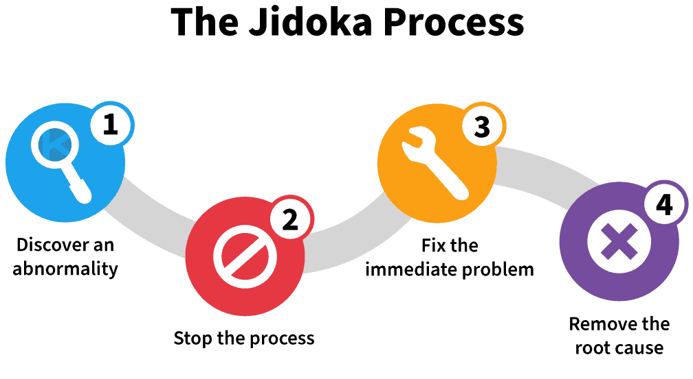
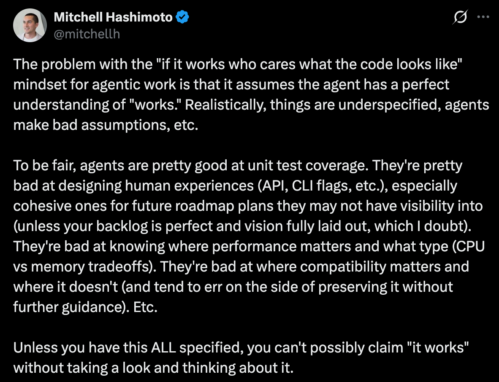

The following is 100% written by a human.

> Jidoka is an opinionated Claude Code plugin that builds on top of native plan mode, turning the plan into reviewable units.

### What is Jidoka
Jidoka(`自働化`) is "automation with a human touch". Developed from Toyota, the concept became popular in the 90s as a way to practice lean manufacturing. The high level concept is surprisingly applicable with agent driven software development.


<sub>Source: <a href="https://kanbanzone.com/2020/how-to-apply-the-jidoka-principle-to-boost-your-productivity/">How to apply the Jidoka principle to boost your productivity</a></sub>

### Sometimes vibe coding isn't enough
Agents are increasingly becoming capable of performing large tasks in very long running sessions, spanning days or even weeks. While an impressive technological feat, it is far from clear if this is the ideal way to develop and maintain software.

The fundamental issue boils down to two categories. The first is that it is almost impossible for the agent to have ALL of the context needed to build the perfect software, especially when it comes to human taste and future roadmaps. Even when the agent does have all the context, only one bad technical decision is all it takes for the mistake to ripple across the entire project.

The second, and the most critical issue is that as agents write more software autonomously, it becomes harder for the human to reason about the project. Once the drift happens the human is no longer the steward of the project. While not all software written needs to be 100% understood, we can easily think of cases where we need to know exactly how it is written.

This idea is commonly felt across the community.

> When you vibe code, you are incurring tech debt as fast as the LLM can spit it out. Which is why vibe coding is perfect for prototypes and throwaway projects: It's only legacy code if you have to maintain it!
>
> 
>
> — **Steve Krouse**, [Vibe code is legacy code](https://blog.val.town/vibe-code)

---

> 
>
> — **Mitchell Hashimoto**, [X](https://x.com/mitchellh/status/2066657032938442833)

---

> the central lesson of the vibe-coding month: I didn't refactor enough, the codebase became something I couldn't reason about, and I had to throw it all away. In the rewrite, refactoring became the core of my workflow.
>
> — **Lalit Maganti**, [Eight years of wanting, three months of building with AI](https://lalitm.com/post/building-syntaqlite-ai/)

### Shortcomings of the existing frameworks

The most common way to handle this issue is to specify all of the requirements before the implementation. However frameworks such as [superpowers](https://github.com/obra/superpowers) make the plan **too** verbose, and contain code snippets which can easily become stale. I personally prefer to just use the plan mode built natively inside Claude Code because it is a natural extension of the model and agent framework released by Anthropic.

Plan mode is invoked when the task on hand is large enough that it should be executed in discrete steps, but the current implementation in Claude Code is problematic for a few reasons.
- The output file is saved in the user space under a randomly generated file name (`~/.claude/plans/steady-dreaming-sprout.md`). This makes it cumbersome to view the file in an editor, and difficult to put it in the repo for version control, which is increasingly being preferred as a [way](https://openai.com/index/harness-engineering/) to give the agents a durable source of truth.
- The current SOTA models have 1M context and will likely increase as the models develop, but over long sessions the context window size will never be large enough. As of June 2026 Claude Code only offers automatic compaction that triggers when the context window is 95% full. This can become an [issue](https://github.com/anthropics/claude-code/issues/36068) if the compact is triggered mid session, losing critical context.
- Using different models/harness for planning, implementation, and review is increasingly becoming standard practice, but plan mode does not support this.

### Solution: Jidoka


Jidoka is not a replacement for plan mode, but rather builds on top of it. More specifically we enforce that the skill is called in Plan Mode by blocking the `ExitPlanMode` call with `PreToolUse`, and block the plan mode exit if the jidoka skill is not used. The [prompt](https://github.com/oliver-im/jidoka/blob/main/skills/jidoka/SKILL.md) inside the skill has the instructions to divide the plan into units, where the plan is divided into reviewable, executable parts. Since this is done automatically, the jidoka skill is not possible to invoke manually (via `user-invocable: false`).

Jidoka has a separate tool to capture the plan mode output and divide it into `overview.md` + `progress.md` + `0N-<unit-slug>.md` files into `<plan_dir_root>/<YYMMDD-N-slug>/`, where the default `plan_dir_root` is `docs/exec-plans/active/`. This behavior can be modified via the global `~/.claude/plugins/jidoka/config.json` (or a per-repo `.jidoka.json` override) and is heavily geared toward the author's taste. The convention's other locations are config-driven too — `backlog/` and `completed/` derive as siblings of `plan_dir_root`, and `reference_dir` (design discussions, default `docs/discussions/`) is its own key; `jidoka paths` prints the resolved layout so skills and docs read one source of truth instead of hardcoded paths. The convention *spec* is plugin-owned in the same spirit: `jidoka convention` prints jidoka's canonical `CONVENTION.md` (embedded in the bundle at build) on demand, so consuming repos read it from the plugin instead of vendoring a copy that silently drifts.

After each unit, the default action is to run a review cycle by another agent, and then stop until explicit human approval. This gives the reviewer the chance to see 1) the implementation overview 2) the review agent findings 3) whether to compact or reset the context before the next implementation starts.

For the review process, jidoka has the ability to insert custom bash commands (to run another agent like codex or opencode), or claude plugins to be executed before implementation (`pre_review`), after implementation of each unit (`unit_review`), and after implementation of the entire plan (`plan_review`). The project has a baseline prompt, and the skill appends custom prompts to steer the review agent. The default settings uses `/code-review` plugin and codex for review, and again is heavily geared towards the author's taste.

> [!NOTE]
> **TLDR**
> - Use native plan mode inside Claude Code
> - Use Claude hooks to inject jidoka into plan mode, turning the plan into units
> - Each unit boundary is a place for other agents to review
> - Each unit boundary is a place for humans to see the overview findings, steer the direction, and compact/clear the context window

### Documentation

For an overview of the docs, see [docs/README.md](docs/README.md).

### Installation
```
# inside Claude Code
/plugin marketplace add oliver-im/jidoka
/plugin install jidoka@jidoka
/reload-plugins
```

Note: Node 20+ is required.